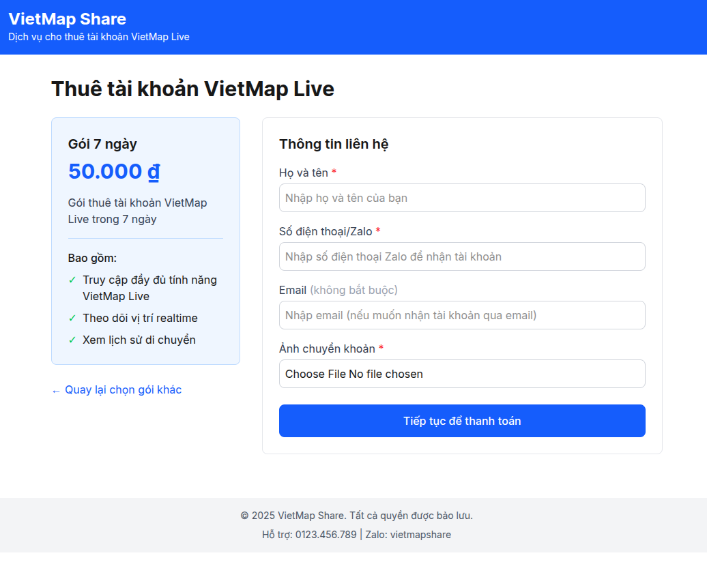

# VietMap Share - Dịch vụ cho thuê tài khoản VietMap Live

VietMap Share là nền tảng cho phép người dùng thuê tài khoản VietMap Live theo ngày với giá cả phải chăng. Đây là giải pháp lý tưởng cho những cá nhân tự do có nhu cầu sử dụng dịch vụ theo dõi GPS tạm thời.



## Tính năng chính

- Thuê tài khoản VietMap Live theo ngày (1/3/7 ngày)
- Thanh toán đơn giản qua chuyển khoản ngân hàng
- Nhận tài khoản ngay sau khi thanh toán
- Giao diện thân thiện, dễ sử dụng

## Công nghệ sử dụng

### Backend
- NestJS
- TypeORM
- SQLite
- Validation với class-validator

### Frontend
- NextJS
- Tailwind CSS
- React Hook Form
- Yup

## Cài đặt và chạy dự án

### Yêu cầu
- Node.js (v16+)
- npm/yarn

### Backend
```bash
cd backend
npm install
npm run start:dev
```

Tạo dữ liệu mẫu:
```bash
npm run seed
```

### Frontend
```bash
cd frontend
npm install
npm run dev
```

## Cấu trúc dự án

### Backend
```
backend/
├── src/
│   ├── accounts/        # Module quản lý tài khoản VietMap
│   ├── packages/        # Module quản lý gói dịch vụ
│   ├── rentals/         # Module quản lý thuê tài khoản
│   ├── seeds/           # Dữ liệu mẫu
│   ├── app.module.ts    # Module chính
│   └── main.ts          # Entry point
└── ...
```

### Frontend
```
frontend/
├── public/              # Static files
├── src/
│   ├── app/             # Next.js App Router
│   ├── components/      # React components
│   ├── config/          # Cấu hình API
│   └── ...
└── ...
```

## API Endpoints

### Packages
- `GET /packages` - Lấy danh sách gói dịch vụ
- `GET /packages/:id` - Lấy thông tin gói dịch vụ theo ID

### Accounts
- `GET /accounts` - Lấy danh sách tài khoản
- `GET /accounts/:id` - Lấy thông tin tài khoản theo ID

### Rentals
- `POST /rentals` - Tạo đơn thuê mới
- `GET /rentals` - Lấy danh sách đơn thuê
- `GET /rentals/:id` - Lấy thông tin đơn thuê theo ID
- `PUT /rentals/:id/payment` - Cập nhật trạng thái thanh toán
- `PUT /rentals/:id/end` - Kết thúc đơn thuê

## Môi trường

Tạo file `.env` trong thư mục `backend` để cấu hình môi trường:

```
PORT=5000
```

## License

MIT 